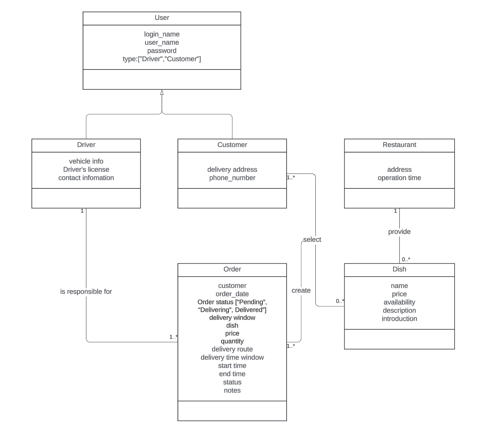
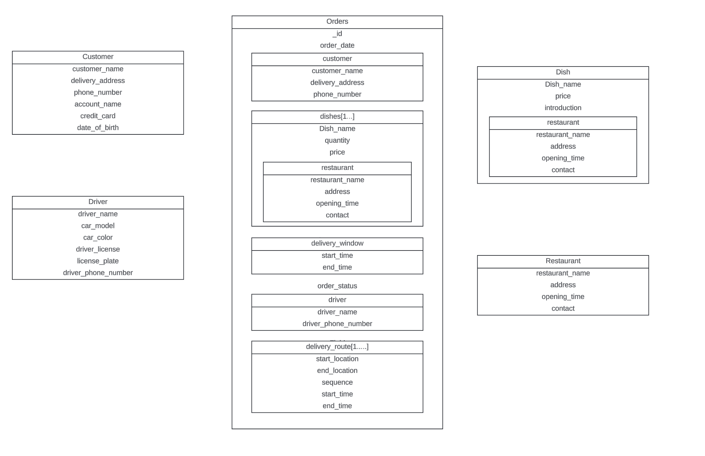
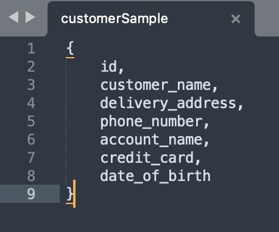
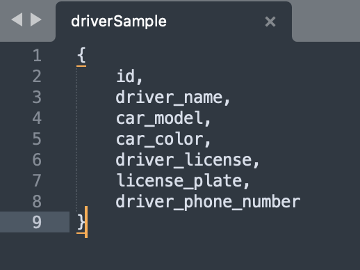
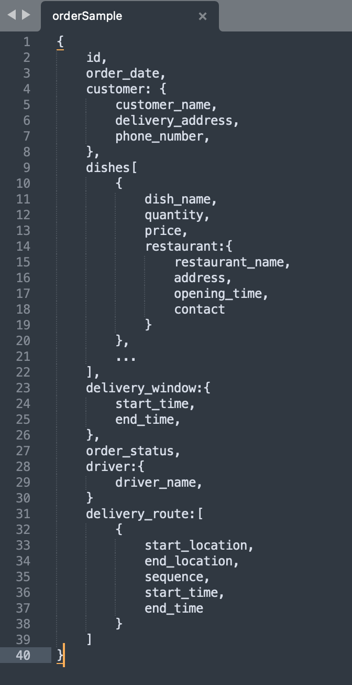
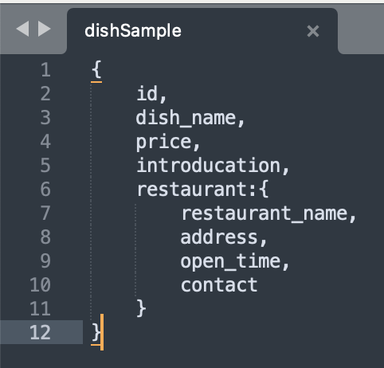
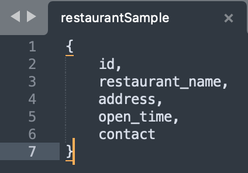

# dish_ordering_system_MongoDB
Project 2 Submission by Qiong Wu

## Business requirements
[Business Requirements.pdf](doc/Requirements.pdf)

## UML Class Diagram


## Logical Data Model


## Collections
### Customer


### Driver


### Order


### Dish


### Restaurant


## Database
Initial database by running:
```
mongorestore --host localhost --port 27017 --archive=db/database.dump --nsInclude='dishOrderSystem.*'
```
or 

```
mongoimport --host localhost --port 27017 --db dishOrderSystem --collection customer --file db/customer.json --type json --jsonArray
mongoimport --host localhost --port 27017 --db dishOrderSystem --collection dish --file db/dish.json --type json --jsonArray
mongoimport --host localhost --port 27017 --db dishOrderSystem --collection driver --file db/driver.json --type json --jsonArray
mongoimport --host localhost --port 27017 --db dishOrderSystem --collection order --file db/order.json --type json --jsonArray
mongoimport --host localhost --port 27017 --db dishOrderSystem --collection restaurant --file db/restaurant.json --type json --jsonArray
```