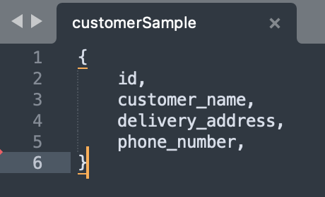

# dish_ordering_system_MongoDB
Project 2 Submission by Qiong Wu

## Business requirements
[Business Requirements.pdf](doc/Requirements.pdf)

## UML Class Diagram

## Logical Data Model

## Collections
### Customer

### Driver

### Order

### Dish

### Restaurant
